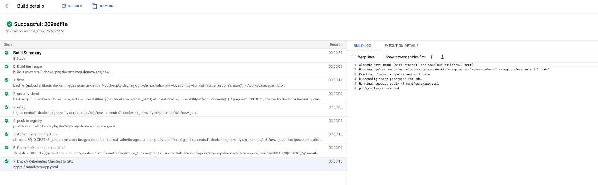

# [GCP Software Delivery Shield](https://cloud.google.com/solutions/software-supply-chain-security) Pipeline


This repo shows how to integrate [Container Analysis](https://cloud.google.com/container-analysis/docs), [Artifact Registry](https://cloud.google.com/artifact-registry) and [Binary Authorization](https://cloud.google.com/binary-authorization) into a [Cloud Build](https://cloud.google.com/build) Pipeline

## Set the required variables

 `Replace PROJECTNAME with your desired Google Cloud project ID`
```
export PROJECT=PROJECTNAME
```
### Add the following variables
```
export KEY_LOCATION=global
export KEYRING=binauthz
export KEY_NAME=lab-key
export KEY_VERSION=1
export ATTESTOR_ID=sds
export NOTE_ID=my-attestor-note
export PROJECT_NUMBER=$(gcloud projects describe "${PROJECT}"  --format="value(projectNumber)")
export BINAUTHZ_SA_EMAIL="service-${PROJECT_NUMBER}@gcp-sa-binaryauthorization.iam.gserviceaccount.com"
```

## ENABLE API'S

```
gcloud services enable container.googleapis.com
gcloud services enable binaryauthorization.googleapis.com
gcloud services enable cloudkms.googleapis.com
gcloud services enable artifactregistry.googleapis.com
gcloud services enable ondemandscanning.googleapis.com
gcloud services enable cloudbuild.googleapis.com
gcloud services enable containerregistry.googleapis.com
gcloud services enable compute.googleapis.com
```

## Import the Binary Auth Docker Container
```
git clone https://github.com/GoogleCloudPlatform/gke-binary-auth-tools
cd gke-binary-auth-tools
gcloud builds submit --project $PROJECT --tag "gcr.io/$PROJECT/cloudbuild-attestor"
```
## Clone this repo
```
cd ../
git clone https://github.com/louayshaat/gcp-software-delivery-shield
cd gcp-software-delivery-shield
```


## Create Artifact Repistry repo
```
gcloud artifacts repositories create sds --location=us-central1 --repository-format=docker --description="Docker repository"
gcloud auth configure-docker us-central1-docker.pkg.dev
```

## Create GKE Cluster
```
gcloud beta container clusters create sds --region us-central1  --binauthz-evaluation-mode=PROJECT_SINGLETON_POLICY_ENFORCE
```
## Create Binary Attestation

#### Create a note
```
cat > ./create_note_request.json << EOM
{
  "attestation": {
    "hint": {
      "human_readable_name": "This note represents an attestation authority"
    }
  }
}
EOM
```

#### Submit the note

```
curl -vvv -X POST \
    -H "Content-Type: application/json"  \
    -H "Authorization: Bearer $(gcloud auth print-access-token)"  \
    --data-binary @./create_note_request.json  \
    "https://containeranalysis.googleapis.com/v1/projects/$PROJECT/notes/?noteId=my-attestor-note"
```

#### Verify the note

```
curl -vvv  \
    -H "Authorization: Bearer $(gcloud auth print-access-token)" \
    "https://containeranalysis.googleapis.com/v1/projects/$PROJECT/notes/my-attestor-note"
```

#### Create attester

```
gcloud container binauthz attestors create $ATTESTOR_ID \
    --attestation-authority-note=my-attestor-note \
    --attestation-authority-note-project=$PROJECT
```
    
#### Verify Attestor
```
gcloud container binauthz attestors list
```

#### Create Key Ring
```
gcloud kms keyrings create "${KEYRING}" --location="${KEY_LOCATION}"
```
#### Create key pair
```
gcloud kms keys create "${KEY_NAME}" \
    --keyring="${KEYRING}" --location="${KEY_LOCATION}" \
    --purpose asymmetric-signing  --default-algorithm="ec-sign-p256-sha256"
```    
#### Add IAM Access

```
cat > ./iam_request.json << EOM
{
  'resource': 'projects/${PROJECT}/notes/${NOTE_ID}',
  'policy': {
    'bindings': [
      {
        'role': 'roles/containeranalysis.notes.occurrences.viewer',
        'members': [
          'serviceAccount:${BINAUTHZ_SA_EMAIL}'
        ]
      }
    ]
  }
}
EOM
```


```
curl -X POST  \
    -H "Content-Type: application/json" \
    -H "Authorization: Bearer $(gcloud auth print-access-token)" \
    --data-binary @./iam_request.json \
    "https://containeranalysis.googleapis.com/v1/projects/${PROJECT}/notes/${NOTE_ID}:setIamPolicy"
```


#### Associate the key with your authority
```
gcloud beta container binauthz attestors public-keys add  \
    --attestor="${ATTESTOR_ID}"  \
    --keyversion-project="${PROJECT}"  \
    --keyversion-location="${KEY_LOCATION}" \
    --keyversion-keyring="${KEYRING}" \
    --keyversion-key="${KEY_NAME}" \
    --keyversion="${KEY_VERSION}"
```
#### Create a Policy
```
cat << EOF > policy.yaml
    globalPolicyEvaluationMode: ENABLE
    defaultAdmissionRule:
      evaluationMode: REQUIRE_ATTESTATION
      enforcementMode: ENFORCED_BLOCK_AND_AUDIT_LOG
      requireAttestationsBy:
      - projects/${PROJECT}/attestors/${ATTESTOR_ID}
EOF
```

#### Import policy
```
gcloud container binauthz policy import policy.yaml
```

#### Add IAM roles for Cloud Build

```
gcloud projects add-iam-policy-binding ${PROJECT} --member="serviceAccount:${PROJECT_NUMBER}@cloudbuild.gserviceaccount.com" --role="roles/iam.serviceAccountUser"
gcloud projects add-iam-policy-binding ${PROJECT}  --member="serviceAccount:${PROJECT_NUMBER}@cloudbuild.gserviceaccount.com" --role="roles/ondemandscanning.admin"
gcloud projects add-iam-policy-binding ${PROJECT} --member serviceAccount:${PROJECT_NUMBER}@cloudbuild.gserviceaccount.com --role="roles/cloudkms.signerVerifier"
gcloud projects add-iam-policy-binding ${PROJECT} --member serviceAccount:${PROJECT_NUMBER}@cloudbuild.gserviceaccount.com --role="roles/binaryauthorization.attestorsViewer"
gcloud projects add-iam-policy-binding ${PROJECT} --member serviceAccount:${PROJECT_NUMBER}@cloudbuild.gserviceaccount.com --role="roles/containeranalysis.notes.attacher"
gcloud projects add-iam-policy-binding ${PROJECT} --member="serviceAccount:${PROJECT_NUMBER}@cloudbuild.gserviceaccount.com" --role="roles/container.developer"
```

## Update the cloudbuild file and manifest files

Replace the $PROJECT value with your project name in the cloudbuild.yaml file

Change YOURPRJECTNAME with your project name
```
sed -ic 's/$PROJECT/YOURPRJECTNAME/g' cloudbuild.yaml
sed -ic 's/$PROJECT/YOURPRJECTNAME/g' manifests/app.yaml.tpl
```

## Run the build
```
gcloud builds submit --config=cloudbuild.yaml
```


A successful build will run through the 7 steps on building the imnage, scanning it, passing the checks, tagging it, pushing it to Artifact registry, Attesting it using Binary auth and deploying a manifest to GKE
