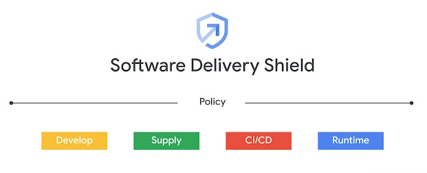

# [GCP Software Delivery Shield](https://cloud.google.com/solutions/software-supply-chain-security) Pipeline




This repo shows how to integrate [Container Analysis](https://cloud.google.com/container-analysis/docs), [Artifact Registry](https://cloud.google.com/artifact-registry) and [Binary Authorization](https://cloud.google.com/binary-authorization) into a [Cloud Build](https://cloud.google.com/build) Pipeline

### Set the required variables

 `Replace PROJECTNAME with your desired Google Cloud project ID`


```
export PROJECT=PROJECTNAME
export KEY_LOCATION=global
export KEYRING=binauthz
export KEY_NAME=lab-key
export KEY_VERSION=1
export ATTESTOR_ID=sds
```

## Import the Binary Auth Docker Container
```
git clone https://github.com/GoogleCloudPlatform/gke-binary-auth-tools
cd gke-binary-auth-tools
gcloud builds submit --project $PROJECT --tag "gcr.io/$PROJECT/cloudbuild-attestor"
```
## Clone this repo
```
cd ../
git clone https://github.com/louayshaat/gcp-software-delivery-shield
cd gcp-software-delivery-shield
```

## Create Artifact Repistry repo
```
gcloud artifacts repositories create sds --location=us-central1 --repository-format=docker
```

## Create Binary Attestation

#### Create a note
```
cat > ./create_note_request.json << EOM
{
  "attestation": {
    "hint": {
      "human_readable_name": "This note represents an attestation authority"
    }
  }
}
EOM
```

#### Submit the note

```
curl -vvv -X POST \
    -H "Content-Type: application/json"  \
    -H "Authorization: Bearer $(gcloud auth print-access-token)"  \
    --data-binary @./create_note_request.json  \
    "https://containeranalysis.googleapis.com/v1/projects/$PROJECT/notes/?noteId=my-attestor-note"
```

#### Verify the note

```
curl -vvv  \
    -H "Authorization: Bearer $(gcloud auth print-access-token)" \
    "https://containeranalysis.googleapis.com/v1/projects/$PROJECT/notes/my-attestor-note"
```

#### Create attester

```
gcloud container binauthz attestors create $ATTESTOR_ID \
    --attestation-authority-note=my-attestor-note \
    --attestation-authority-note-project=$PROJECT
```
    
#### Verify Attestor
```
gcloud container binauthz attestors list
```

#### Create Key Ring
```
gcloud kms keyrings create "${KEYRING}" --location="${KEY_LOCATION}"
```
#### Create key pair
```
gcloud kms keys create "${KEY_NAME}" \
    --keyring="${KEYRING}" --location="${KEY_LOCATION}" \
    --purpose asymmetric-signing  --default-algorithm="ec-sign-p256-sha256"
```    
#### Associate the key with your authority
```
gcloud beta container binauthz attestors public-keys add  \
    --attestor="${ATTESTOR_ID}"  \
    --keyversion-project=“${PROJECT}”  \
    --keyversion-location="${KEY_LOCATION}" \
    --keyversion-keyring="${KEYRING}" \
    --keyversion-key="${KEY_NAME}" \
    --keyversion="${KEY_VERSION}"
```
#### Create a Policy
```
cat << EOF > policy.yaml
    globalPolicyEvaluationMode: ENABLE
    defaultAdmissionRule:
      evaluationMode: REQUIRE_ATTESTATION
      enforcementMode: ENFORCED_BLOCK_AND_AUDIT_LOG
      requireAttestationsBy:
      - projects/${PROJECT_ID}/attestors/${ATTESTOR_ID}
EOF
```

#### Import policy
```
gcloud container binauthz policy import policy.yaml
```

## Update the cloudbuild file

Replace the project and repo-name in the cloudbuild.yaml file with your repo that you created in case you use a different name
```
sed -i 's/$PROJECT/core-demos/g' cloudbuild.yaml
```

## Run the build
```
gcloud builds submit --config=cloudbuild.yaml
```
